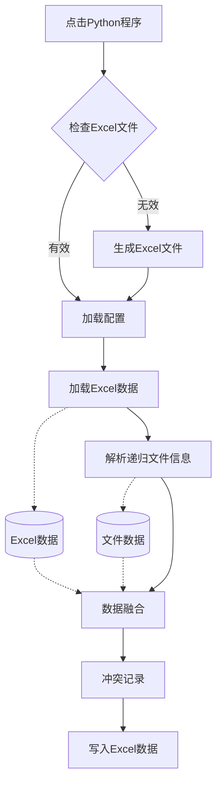

---
export_on_save:
    html: true
---

## 流程



## 脚本结构
- Main：主流程
- XlManager：实现Excel读写的功能
  - pandas
  - openpyxl
- ConfManager：配置项的加载、读取、存储功能
  - os
  - json
  - codes
- FileManager：实际文件信息获取、递归文件目录获取等功能
  - os
- DataManager：数据融合、比较、冲突记录

## 数据结构
- Excel数据

id|名称|数据类型|产生方式|备注
--|--|--|--|--
key|key|float|代码|修改时间+文件大小 拼接而成
label1|标签1|string|用户维护|自定义项
label2|标签2|string|用户维护|自定义项
label3|标签3|string|用户维护|自定义项
filename|文件名|string|代码|
ext|扩展名|string|代码|
filetype|文件类型|无|公式|在Excel中自定义后映射
is_folder|是文件夹|bool|代码|
path|文件路径|string|代码|仅记录相对路径
hyperlink|文件链接|无|公式|通过path计算
size|文件大小|int|代码|
ctime|创建时间|float|代码|
mtime|修改时间|float|代码|
atime|访问时间|float|代码|
note|备注|string|用户维护|

```python
data = {
  key1:{'label1':'a','label2':'b'...},
  key2:{'label1':'','label2':'a'...},
  ...
}
```
